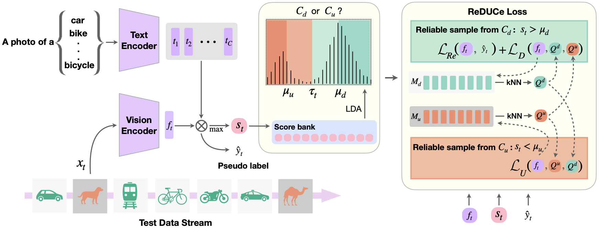

# ROSITA

Official code implementation for the paper **"EFFICIENT OPEN-WORLD TEST TIME ADAPTATION OF VISION LANGUAGE MODELS"**

> 
 <b> ROSITA framework</b>:
>     In dynamic real-world settings, models must adapt to changing data distributions, a challenge known as Test Time Adaptation (TTA). Open-world classification, where a model must distinguish between known and unknown classes, further complicates TTA. We introduce ROSITA, a novel method for Open World Single Image Test Time Adaptation using Vision-Language Models (VLMs). ROSITA leverages feature banks and a novel contrastive loss to improve the separation of known and unknown classes, enabling efficient adaptation to domain shifts while equipping the model to reject unknown classes. Our approach sets a new benchmark for this problem, validated through extensive experiments across diverse real-world test environments.

---

### Installation

Please follow the instructions at [INSTALL.md](docs/INSTALL.md) to setup the environment.

### Dataset preparation

Please follow the instructions at [DATASETS.md](docs/DATASETS.md) to prepare the datasets.

### Experiments

Please follow the instructions at [RUN.md](docs/RUN.md) to run the experiments.

---

### Acknowledgements

The baselines have been established with the help these repositories:

1. [TPT](https://github.com/azshue/TPT)
2. [PromptAlign](https://github.com/jameelhassan/PromptAlign)
3. [OWTTT](https://github.com/Yushu-Li/OWTTT)
